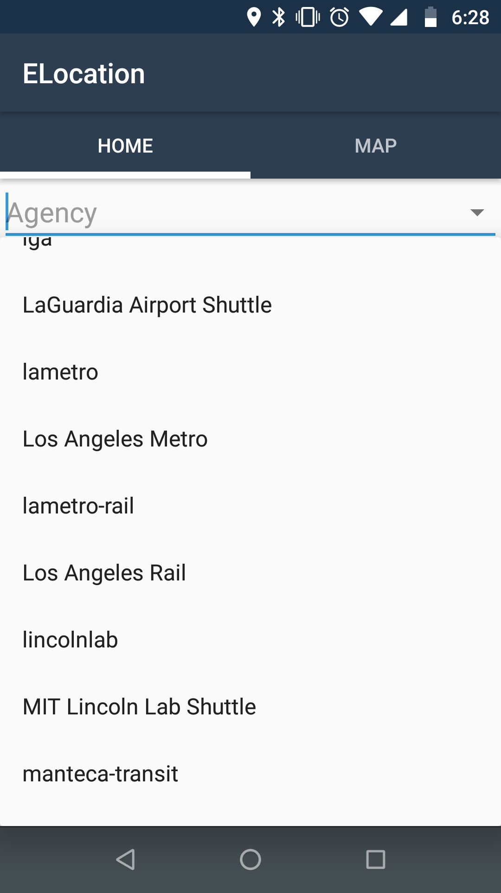
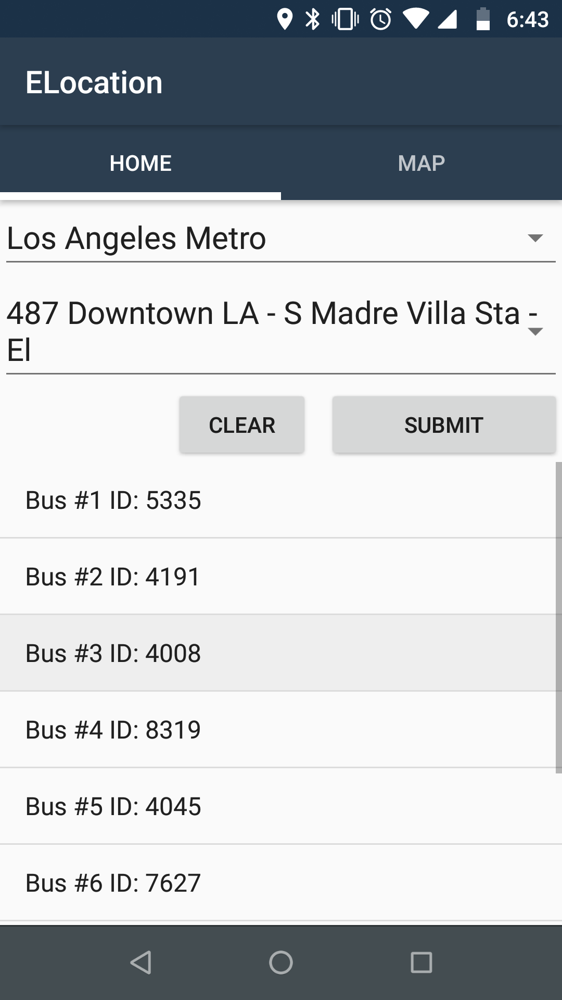
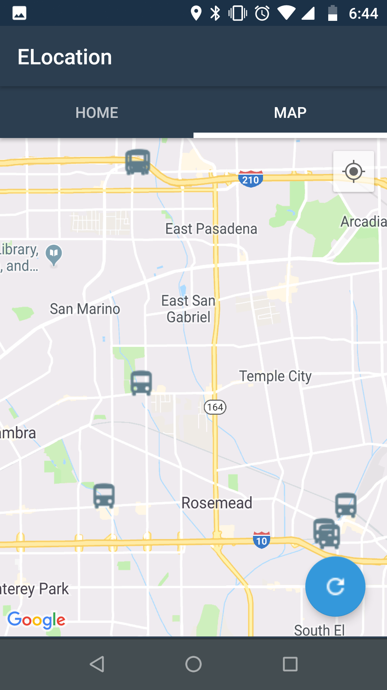
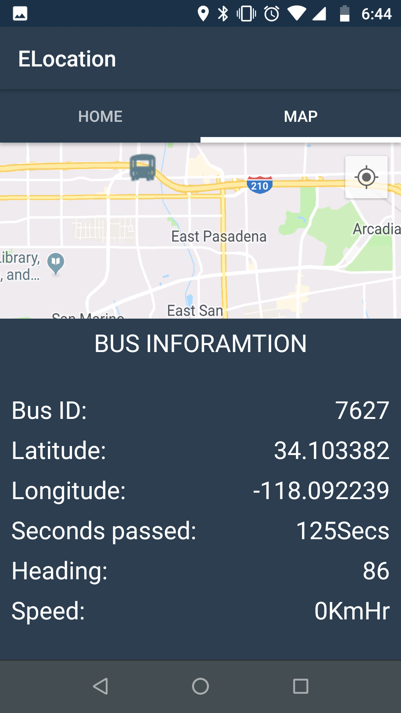
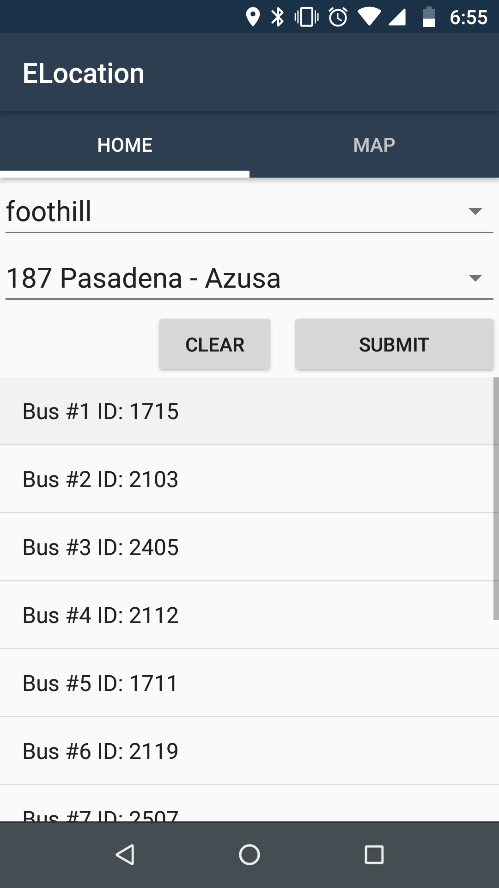
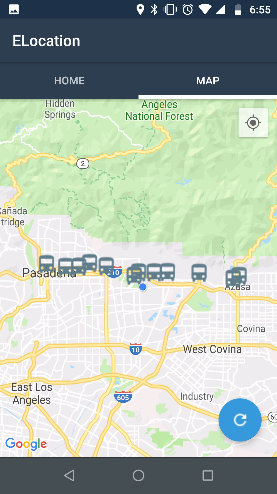

# ELocation
An Android app that focuses on giving the user real-time information of 100+ public buses across the United States. With a simplistic search layout and a map layout for a physical representation of the buses locations. APK: https://drive.google.com/open?id=1Avj91V-o3h5Pb3YWGwa9tWGnJFyjD26s

## Screenshots

